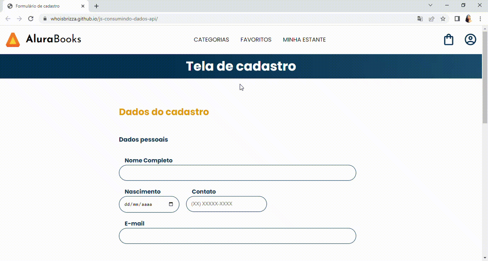

# Programa Desenvolve 2023 - JavaScript: consumindo e tratando dados de uma API

Repositório criado com o objetivo de registrar meu progresso no Programa Desenvolve 2023 do Grupo Boticário em parceira com a Alura praticando o que foi abordado nas aulas do curso:   
JavaScript: consumindo e tratando dados de uma API.  

## Demonstração:

[Consumindo e tratando dados de uma API](https://whoisbrizza.github.io/js-consumindo-dados-api/)

## Tecnologias utilizadas durante o curso

* JavaScript

## Tecnologias utilizadas no projeto
* HTML
* CSS

## Tópicos abordados no curso:

* Entendendo o Javascript  
* Aplicando a assincronicidade  
* Aprofundando em promises  
* Criando funções assíncronas  
* Manipulando formulários
